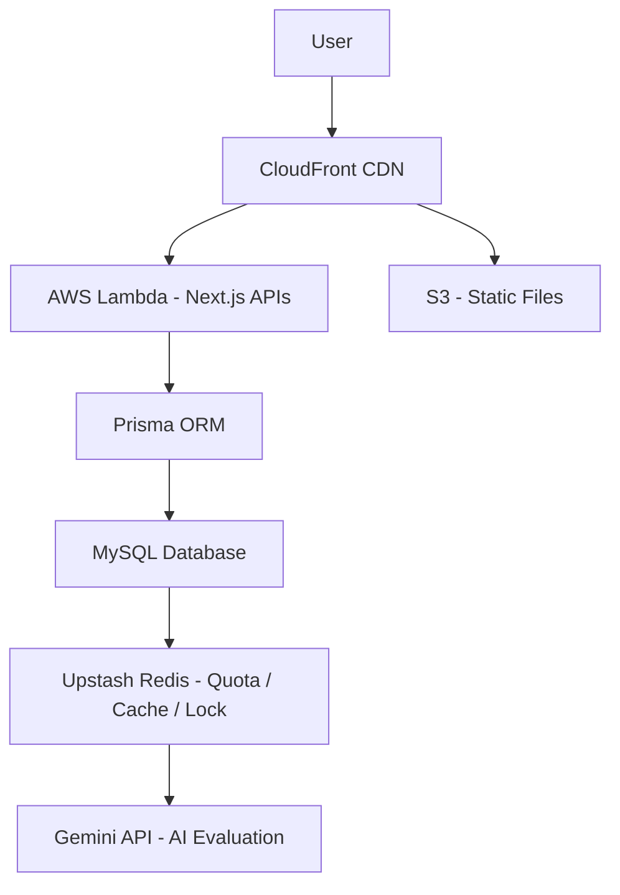

# 🤖 AI Interview Platform

🚀 **Live Demo:** https://d3gp0we9w2ehf7.cloudfront.net/

An AI-powered mock interview platform that generates technical interview questions and evaluates candidate answers using Google Gemini.  
Deployed with a production-grade serverless architecture on AWS.

---

## ✨ Features

- 🎯 Role & Difficulty-based interview sessions
- 🧠 AI-powered answer evaluation (Gemini API)
- 📊 Structured feedback with:
  - Score
  - Detailed feedback
  - Ideal answer
  - Improvement tags
- 🔁 3 sessions/day quota system (Redis TTL)
- ⚡ Evaluation caching (SHA-256 based)
- 🔒 Distributed locking to prevent duplicate submissions
- 📈 Interview analytics tracking
- 🗂️ Session + attempt history persistence
- ☁️ Fully serverless AWS deployment
- 🔄 CI/CD with GitHub Actions

---

## 🏗️ Tech Stack

### Frontend
- Next.js (App Router)
- TypeScript
- Tailwind CSS

### Backend
- Next.js API Routes
- Zod (runtime validation)

### Database
- MySQL (Local)
- TiDB (Online)
- Prisma ORM

### Caching & Rate Limiting
- Upstash Redis
  - Daily quota (TTL-based)
  - Evaluation caching
  - Distributed locking to prevent race condition

### AI Integration
- Google Gemini API

### Cloud & Infrastructure
- AWS Lambda (serverless compute)
- AWS CloudFront (global CDN)
- AWS S3 (static asset storage)
- SST (Serverless Stack)
- OpenNext (Next.js → Lambda adapter)

### DevOps
- GitHub Actions (CI/CD pipeline)
- Automated production deployment to AWS

---

## 📊 Analytics

- Tracks session usage
- Tracks attempt counts per session
- Daily quota monitoring
- Evaluation cache hit optimization

---

## 🏗️ System Architecture

---

## 🔐 Key Engineering Decisions

### 1️⃣ Evaluation Caching
- SHA256(question + answer + promptVersion)
- Prevents duplicate AI calls
- Reduces latency & API cost

### 2️⃣ Daily Quota System
- 3 sessions per user/day
- Implemented using Redis TTL keys

### 3️⃣ Distributed Locking
- Prevents race conditions during answer submission
- Ensures single evaluation per attempt

### 4️⃣ Serverless Deployment
- Zero server management
- Scalable Lambda functions
- Global delivery via CloudFront CDN

### 5️⃣ CI/CD Automation
- GitHub Actions pipeline
- Auto-deploys on push to main branch
- Automated build + SST deployment

---
