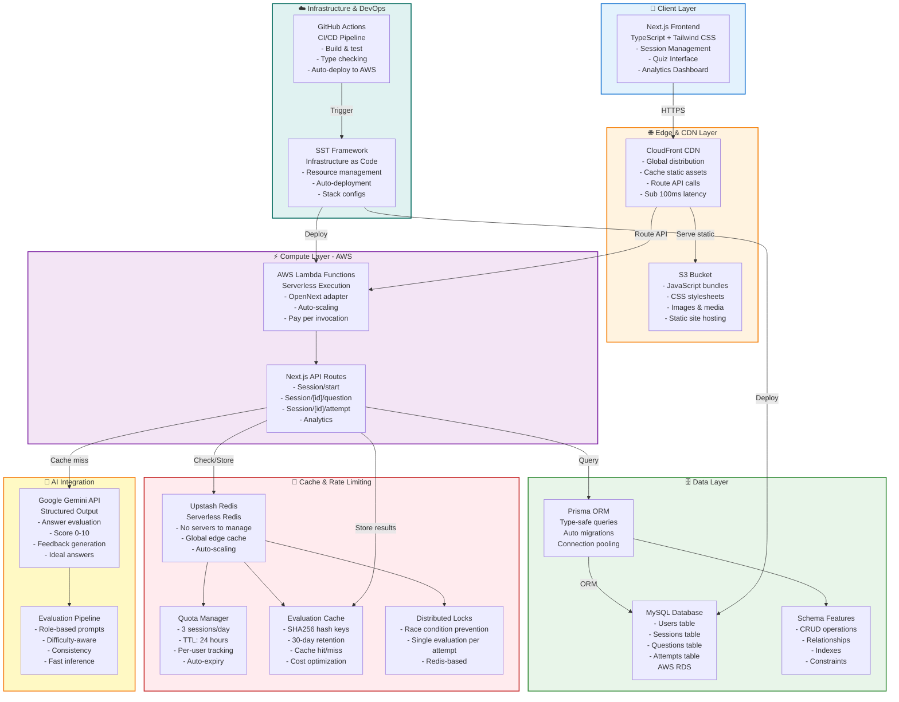

# 🤖 AI Interview Platform

🚀 **Live Demo:** https://d3gp0we9w2ehf7.cloudfront.net/

An AI-powered mock interview platform that generates technical interview questions and evaluates candidate answers using Google Gemini.  
Deployed with a production-grade serverless architecture on AWS.

---

## ✨ Features

- 🎯 Role & Difficulty-based interview sessions
- 🧠 AI-powered answer evaluation (Gemini API)
- 📊 Structured feedback with:
  - Score
  - Detailed feedback
  - Ideal answer
  - Improvement tags
- 🔁 3 sessions/day quota system (Redis TTL)
- ⚡ Evaluation caching (SHA-256 based)
- 🔒 Distributed locking to prevent duplicate submissions
- 📈 Interview analytics tracking
- 🗂️ Session + attempt history persistence
- ☁️ Fully serverless AWS deployment
- 🔄 CI/CD with GitHub Actions

---

## 🏗️ Tech Stack

### Frontend
- Next.js (App Router)
- TypeScript
- Tailwind CSS

### Backend
- Next.js API Routes
- Zod (runtime validation)

### Database
- MySQL (Local)
- TiDB (Online)
- Prisma ORM

### Caching & Rate Limiting
- Upstash Redis
  - Daily quota (TTL-based)
  - Evaluation caching
  - Distributed locking to prevent race condition

### AI Integration
- Google Gemini API

### Cloud & Infrastructure
- AWS Lambda (serverless compute)
- AWS CloudFront (global CDN)
- AWS S3 (static asset storage)
- SST (Serverless Stack)
- OpenNext (Next.js → Lambda adapter)

### DevOps
- GitHub Actions (CI/CD pipeline)
- Automated production deployment to AWS

---

## 🏗️ System Architecture


```mermaid
graph TB
    subgraph client["👤 Client Layer"]
        UI["Next.js Frontend<br/>TypeScript + Tailwind CSS<br/>- Session Management<br/>- Quiz Interface<br/>- Analytics Dashboard"]
    end
    
    subgraph edge["🌐 Edge & CDN Layer"]
        CF["CloudFront CDN<br/>- Global distribution<br/>- Cache static assets<br/>- Route API calls<br/>- Sub 100ms latency"]
        S3["S3 Bucket<br/>- JavaScript bundles<br/>- CSS stylesheets<br/>- Images & media<br/>- Static site hosting"]
    end
    
    subgraph compute["⚡ Compute Layer - AWS"]
        Lambda["AWS Lambda Functions<br/>Serverless Execution<br/>- OpenNext adapter<br/>- Auto-scaling<br/>- Pay per invocation"]
        API["Next.js API Routes<br/>- Session/start<br/>- Session/[id]/question<br/>- Session/[id]/attempt<br/>- Analytics"]
    end
    
    subgraph data["🗄️ Data Layer"]
        Prisma["Prisma ORM<br/>Type-safe queries<br/>Auto migrations<br/>Connection pooling"]
        MySQL["MySQL Database<br/>- Users table<br/>- Sessions table<br/>- Questions table<br/>- Attempts table<br/>AWS RDS"]
        Schema["Schema Features<br/>- CRUD operations<br/>- Relationships<br/>- Indexes<br/>- Constraints"]
    end
    
    subgraph cache["💾 Cache & Rate Limiting"]
        Redis["Upstash Redis<br/>Serverless Redis<br/>- No servers to manage<br/>- Global edge cache<br/>- Auto-scaling"]
        Quota["Quota Manager<br/>- 3 sessions/day<br/>- TTL: 24 hours<br/>- Per-user tracking<br/>- Auto-expiry"]
        EvalCache["Evaluation Cache<br/>- SHA256 hash keys<br/>- 30-day retention<br/>- Cache hit/miss<br/>- Cost optimization"]
        Locks["Distributed Locks<br/>- Race condition prevention<br/>- Single evaluation per attempt<br/>- Redis-based"]
    end
    
    subgraph ai["🤖 AI Integration"]
        Gemini["Google Gemini API<br/>Structured Output<br/>- Answer evaluation<br/>- Score 0-10<br/>- Feedback generation<br/>- Ideal answers"]
        Eval["Evaluation Pipeline<br/>- Role-based prompts<br/>- Difficulty-aware<br/>- Consistency<br/>- Fast inference"]
    end
    
    subgraph infra["☁️ Infrastructure & DevOps"]
        SST["SST Framework<br/>Infrastructure as Code<br/>- Resource management<br/>- Auto-deployment<br/>- Stack configs"]
        GithubActions["GitHub Actions<br/>CI/CD Pipeline<br/>- Build & test<br/>- Type checking<br/>- Auto-deploy to AWS"]
    end
    
    UI -->|HTTPS| CF
    CF -->|Serve static| S3
    CF -->|Route API| Lambda
    Lambda --> API
    API -->|Query| Prisma
    Prisma -->|ORM| MySQL
    Prisma --> Schema
    API -->|Check/Store| Redis
    Redis --> Quota
    Redis --> EvalCache
    Redis --> Locks
    API -->|Cache miss| Gemini
    Gemini --> Eval
    API -->|Store results| EvalCache
    SST -->|Deploy| Lambda
    SST -->|Deploy| MySQL
    GithubActions -->|Trigger| SST
    
    style client fill:#e3f2fd,stroke:#1976d2,stroke-width:2px
    style edge fill:#fff3e0,stroke:#f57c00,stroke-width:2px
    style compute fill:#f3e5f5,stroke:#7b1fa2,stroke-width:2px
    style data fill:#e8f5e9,stroke:#388e3c,stroke-width:2px
    style cache fill:#ffebee,stroke:#c62828,stroke-width:2px
    style ai fill:#fff9c4,stroke:#f57f17,stroke-width:2px
    style infra fill:#e0f2f1,stroke:#00695c,stroke-width:2px
```

### Architecture Deep Dive

**Frontend Layer (Next.js)**
- React components with TypeScript
- App Router for dynamic routing
- Tailwind CSS for styling
- Real-time state management
- Responsive design for all devices

**Edge Layer (CloudFront + S3)**
- Global CDN with 200+ edge locations
- Caches static assets (JS, CSS, images)
- Distributes API requests to Lambda
- Sub-100ms response times worldwide

**Compute Layer (AWS Lambda)**
- Serverless functions running Next.js
- OpenNext adapter converts Next.js to Lambda-friendly format
- Auto-scales from 0 to thousands of concurrent requests
- Cold start: ~200-500ms (acceptable for this use case)
- Warm start: <50ms for cache hits

**Data Layer (MySQL + Prisma)**
- MySQL database on AWS RDS
- Prisma ORM provides type-safe queries
- Automatic migrations for schema changes
- Connection pooling for performance
- Indexes on frequently queried columns

**Cache & Rate Limiting (Upstash Redis)**
- Serverless Redis (no infrastructure management)
- Quota system: 3 sessions/day using TTL keys
- Evaluation cache: SHA256 hash-based caching (60-70% cost savings)
- Distributed locks: Prevent race conditions
- Global edge cache for sub-50ms access

**AI Integration (Google Gemini)**
- Structured output for consistent JSON responses
- System prompts for interview-aware evaluation
- Fallback retry logic with exponential backoff
- Rate limiting and quota management

**DevOps & Infrastructure**
- SST (Serverless Stack) as Infrastructure as Code
- GitHub Actions for automated CI/CD
- Automatic deployment on git push
- Environment-specific configurations
- Resource provisioning and deletion

---

## 📊 Complete User Flow

**1. User starts interview session:**
- Selects job role and difficulty level
- System creates `InterviewSession` with unique `sessionId`
- Quota checked in Redis (3 sessions/day limit)

**2. Question Loop:**
- User gets random question filtered by role & difficulty
- User submits answer (3-8000 characters)

**3. Smart Evaluation Pipeline:**
- Generate SHA256 hash of (question + answer + version)
- Check Redis cache with hash key
  - ✅ **Cache Hit** → Return cached result (50ms response)
  - ✗ **Cache Miss** → Call Gemini API (2-5s response)
- Store evaluation in Redis with 30-day TTL

**4. Response:**
- Display Score (0-10), Feedback, Ideal Answer, Tags
- Store Attempt record in MySQL database

**5. Continue or End:**
- Loop back for more questions OR
- End session and show analytics

### Performance Summary

| Operation | Time | Cache Status |
|-----------|------|--------------|
| Get question (DB) | 30-100ms | N/A |
| Submit with cache | ~50ms | Hit ✅ |
| Submit with AI | 2-5s | Miss ✗ |
| Full session | Variable | Optimized |

---

## 🔐 Key Engineering Decisions

### 1️⃣ Evaluation Caching
- SHA256(question + answer + promptVersion)
- Prevents duplicate AI calls
- Reduces latency & API cost

### 2️⃣ Daily Quota System
- 3 sessions per user/day
- Implemented using Redis TTL keys

### 3️⃣ Distributed Locking
- Prevents race conditions during answer submission
- Ensures single evaluation per attempt

### 4️⃣ Serverless Deployment
- Zero server management
- Scalable Lambda functions
- Global delivery via CloudFront CDN

### 5️⃣ CI/CD Automation
- GitHub Actions pipeline
- Auto-deploys on push to main branch
- Automated build + SST deployment

---

## 🚀 Quick Start

### Prerequisites
- Node.js 18+
- MySQL 8.0+
- npm or yarn

### Local Development

```bash
# 1. Clone and install
git clone <repository-url>
cd ai-interview-platform
npm install

# 2. Setup environment
cp .env.example .env.local
# Edit .env.local with your API keys:
# - GEMINI_API_KEY
# - DATABASE_URL
# - UPSTASH_REDIS_URL
# - UPSTASH_REDIS_TOKEN

# 3. Database setup
npx prisma migrate dev
npx prisma db seed

# 4. Start development server
npm run dev

# 5. Open in browser
# http://localhost:3000
```

### Prisma Commands

```bash
# Launch Prisma Studio (visual DB browser)
npx prisma studio

# Create a new migration
npx prisma migrate dev --name <migration_name>

# Reset database
npx prisma migrate reset

# Seed test data
npx prisma db seed
```

---

## 📡 API Endpoints

### Session Management
```http
POST   /api/session/start
GET    /api/session/[id]/meta
POST   /api/session/[id]/end
```

### Questions & Attempts
```http
GET    /api/session/[id]/question
POST   /api/session/[id]/attempt
```

### Analytics
```http
GET    /api/analytics
```

See [WORKFLOW_DIAGRAM.md](./docs/WORKFLOW_DIAGRAM.md) for detailed request/response formats.

---

## 🧪 Testing & Validation

- **Input Validation**: Zod runtime schema validation on all API requests
- **Type Safety**: Full TypeScript coverage
- **Database Migrations**: Tracked via Prisma migrations
- **Linting**: ESLint configuration for code quality

```bash
# Run type checking
npx tsc --noEmit

# Run linting
npm run lint

# Build for production
npm run build

# Start production server
npm start
```

---

## 📦 Project Structure

```
ai-interview-platform/
├── src/
│   ├── app/                    # Next.js App Router
│   │   ├── api/               # API routes
│   │   │   ├── session/       # Session endpoints
│   │   │   └── analytics/     # Analytics endpoint
│   │   ├── layout.tsx         # Root layout
│   │   ├── page.tsx           # Home page
│   │   └── globals.css        # Global styles
│   └── lib/                    # Utility functions
│       ├── gemini.ts          # Gemini API integration
│       ├── prisma.ts          # Prisma singleton
│       ├── redis.ts           # Redis client
│       ├── quotas.ts          # Quota management
│       ├── evalCache.ts       # Evaluation caching
│       ├── hash.ts            # SHA256 hashing
│       └── redisLock.ts       # Distributed locking
├── prisma/
│   ├── schema.prisma          # Database schema
│   ├── seed.ts                # Database seeding
│   └── migrations/            # Migration history
├── docs/
│   ├── WORKFLOW_DIAGRAM.pdf   # Complete workflow (PDF)
│   └── WORKFLOW_DIAGRAM.md    # Workflow documentation
├── public/                     # Static assets
└── package.json
```

---

## 🌐 Production Deployment

### AWS Infrastructure
- **Compute**: AWS Lambda (serverless)
- **Storage**: S3 + CloudFront CDN
- **Database**: AWS RDS (MySQL)
- **Cache**: Upstash Redis (serverless)
- **CI/CD**: GitHub Actions

### Deployment via SST

```bash
# Deploy to production (requires AWS credentials)
npx sst deploy --stage prod

# View logs
npx sst logs --stage prod

# Destroy resources (caution!)
npx sst remove --stage prod
```

### Environment Variables (Production)

Create `.env.production` with:
```
GEMINI_API_KEY=<your-key>
DATABASE_URL=mysql://<user>:<pass>@<host>/<db>
UPSTASH_REDIS_URL=<redis-url>
UPSTASH_REDIS_TOKEN=<redis-token>
```

---

## 🔍 Troubleshooting

### Common Issues

| Issue | Solution |
|-------|----------|
| "Daily quota reached" | Wait 24 hours or change user session |
| Database connection error | Check `.env.local` DATABASE_URL |
| Gemini API errors | Verify GEMINI_API_KEY and API quota |
| Redis connection failed | Check UPSTASH_REDIS_URL and token |
| Cold start on Lambda | Expected behavior (200-500ms) |
| Cache not working | Verify evalHash generation and Redis TTL |

### Debug Mode

```bash
# Enable verbose logging
DEBUG=* npm run dev

# Check database state
npx prisma studio

# Monitor Redis
redis-cli MONITOR
```

---

## 🛣️ Roadmap & Future Enhancements

- [ ] User authentication (OAuth/JWT)
- [ ] Payment system integration
- [ ] Real-time interview sessions (WebSocket)
- [ ] Interview recordings & transcripts
- [ ] Achievement badges & gamification
- [ ] Mobile app (React Native)
- [ ] PDF report export
- [ ] Interview coaching mode
- [ ] Team/company accounts
- [ ] Interview question analytics

---

## 📝 Database Schema

### Main Tables

**User**
- `id` - UUID (cookie-based)
- `createdAt` - Timestamp

**InterviewSession**
- `id` - CUID (primary key)
- `userId` - Foreign key to User
- `role` - Job role (string)
- `difficulty` - Easy/Medium/Hard (enum)
- `status` - ACTIVE/ENDED (enum)
- `startedAt` - Session start time
- `endedAt` - Session end time (nullable)

**Question**
- `id` - CUID (primary key)
- `role` - Interview role
- `difficulty` - Question difficulty
- `prompt` - Full question text
- `tags` - JSON (optional)
- `createdAt` - Creation timestamp

**Attempt**
- `id` - CUID (primary key)
- `sessionId` - Foreign key
- `questionId` - Foreign key
- `answerText` - User's answer
- `score` - 0-10 (computed by Gemini)
- `feedback` - AI feedback
- `idealAnswer` - Best possible answer
- `tags` - Improvement areas (JSON)
- `evalHash` - SHA256 cache key
- `createdAt` - Submission time

See [Prisma Schema](./prisma/schema.prisma) for complete database model.

---

## 📄 License

This project is licensed under the MIT License - see [LICENSE](./LICENSE) file for details.

---

## 🤝 Contributing

Contributions are welcome! Please follow these steps:

1. Fork the repository
2. Create a feature branch (`git checkout -b feature/amazing-feature`)
3. Commit your changes (`git commit -m 'Add amazing feature'`)
4. Push to the branch (`git push origin feature/amazing-feature`)
5. Open a Pull Request

---

## 📞 Support & Questions

- 📖 Check the [complete workflow documentation](./docs/WORKFLOW_DIAGRAM.md)
- 🐛 Report bugs via GitHub Issues
- 💬 Ask questions in Discussions
- 📧 Contact: [Your Contact Info]

---

**Built with ❤️ using Next.js, TypeScript, and AWS**

*Last Updated: October 2026*
